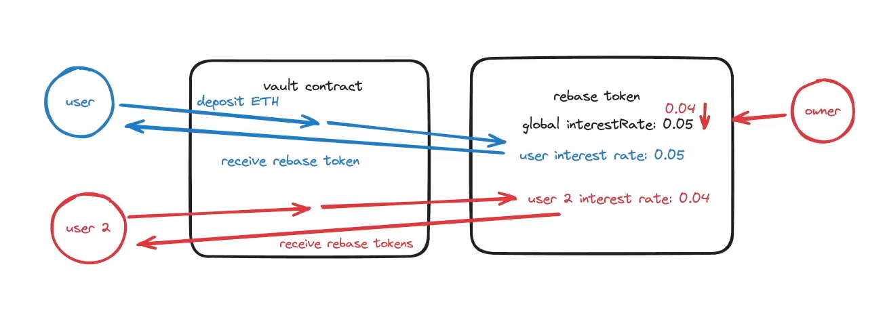

# Cyfrin Advanced Foundry Cross-chain Rebase Token

This is a section of the [Cyfrin Foundry Solidity Course](https://github.com/Cyfrin/foundry-full-course-cu?tab=readme-ov-file#advanced-foundry-section-4-foundry-cross-chain-rebase-token).

## Protocol specs

1. Allows users to deposit into a vault and in return, receive rebase tokens that represent their underlying balance.
2. Rebase token -> `balanceOf` function is dynamic to show the changing balance over time.
    1. Balance increases linearly over time.
    2. Mints tokens to users every time they perform an action (mint, burn, transfer, bridge).
    3. Interest rate
        1. Individually set an interest rate for each user based on the global interest rate of the protocol at the time the user deposits into the vault.
        2. This global interest rate can only decrease to incetivise/reward early adopters.
3. Known issues
    1. The `totalSupply` function doesn't include the interests that are not minted yet.
    2. If we deposit a small amount to `wallet A` at a high interest rate
    and then later deposit a large amount to `wallet B` at a lower interest rate,
    and we trasfer our founds from `wallet B` to `wallet A`,
    we can have the high interest rate on all our funds which is not the intended behavior.
    3. `mint and burn` role is granted to users, which makes the protocol somewhat centralized.

