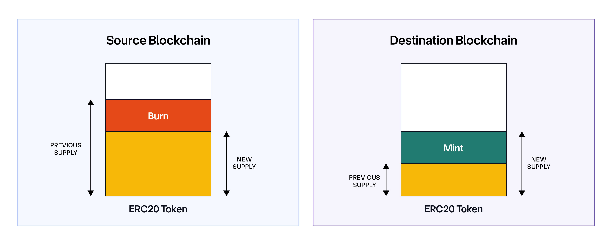
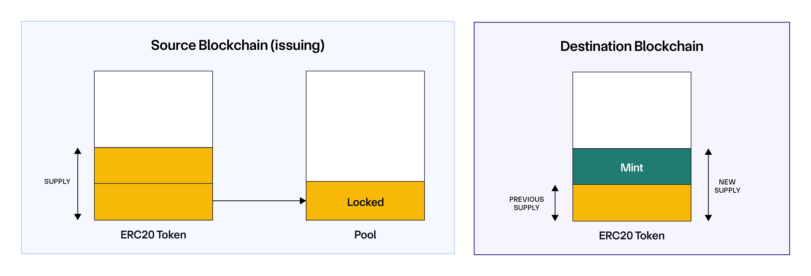
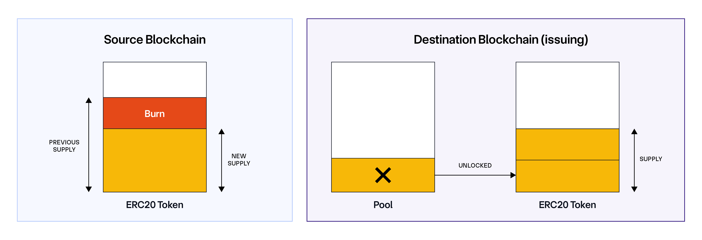
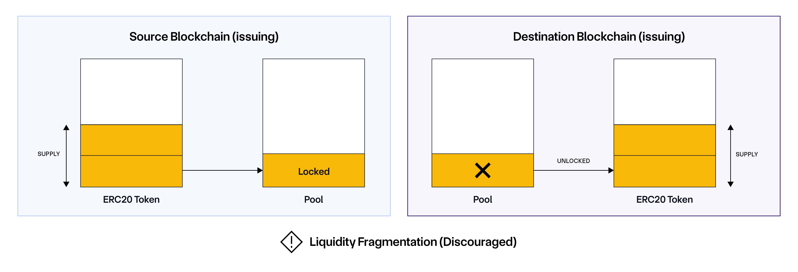

# Cyfrin Advanced Foundry Cross-chain Rebase Token

This is a section of the [Cyfrin Foundry Solidity Course](https://github.com/Cyfrin/foundry-full-course-cu?tab=readme-ov-file#advanced-foundry-section-4-foundry-cross-chain-rebase-token).

## Rebase token implementation

* Allows users to deposit into a vault and in return, receive rebase tokens that represent their underlying balance.
* Rebase token -> `balanceOf` function is dynamic to show the changing balance over time.
  * Balance increases linearly over time.
  * Mints tokens to users every time they perform an action (mint, burn, transfer, bridge).
  * Interest rate
    * Individually set an interest rate for each user
        based on the global interest rate of the protocol at the time the user deposits into the vault.
    * This global interest rate can only decrease to incetivise/reward early adopters.
* Known issues
  * The `totalSupply` function doesn't include the interests that are not minted yet.
  * If we deposit a small amount to `wallet A` at a high interest rate
    and then later deposit a large amount to `wallet B` at a lower interest rate,
    and we trasfer our founds from `wallet B` to `wallet A`,
    we can have the high interest rate on all our funds which is not the intended behavior.
  * If we constantly interact with the protocol with small amounts, the interest is compounded
    because at each intereaction the interest is minted.

## [Chainlink Cross-Chain Interoperability Protocol (CCIP)](https://docs.chain.link/ccip)

Chainlink CCIP is a blockchain interoperability protocol that enables developers
to build secure applications that can transfer tokens, messages (data), or both tokens and messages across chains.

* [Tutorial: Send Arbitrary Data](https://docs.chain.link/ccip/tutorials/send-arbitrary-data)
  * [Browse router and link addresses](https://docs.chain.link/ccip/directory/testnet)
  * [CCIP explorer](https://ccip.chain.link/)

## [Cross Chain Token (CCT) Standard](https://docs.chain.link/ccip/concepts/cross-chain-tokens)

The Cross-Chain Token (CCT) standard offers a streamlined and decentralized approach to enabling
token transfers across blockchains using Chainlink's Cross-Chain Interoperability Protocol (CCIP).

[Here](https://github.com/Cyfrin/ccip-cct-starter) is a simple repositroy with examples written by Cyfrin.

### Reasons for the CCT Standard

1. **Liquidity Fragmentation**

   * Assets are siloed to certain blockchains
   * Difficult for users and liquidity providers to access liquidity across different ecosystems

2. **Token Developer Autonomy**

   * Developers are not required to use a third party to integrate their token cross-chain
   * Developers can integrate their token with CCIP themselves

### Architectural Overview

* Token contract
* Token pool contract

  * The token contract has all of the ERC20 functionality logic inside.

  * The token pool contract contains the logic for sending cross-chain.

  * We will use either a lock and unlock or a mint and burn mechanism to transfer tokens cross-chain.

### Token Admin Registry

* Allows developers to self-register their token
* Associates the token with its token pool

### Bridging methods

#### Burn and mint

Tokens are burnt on the source chain, removed from circulation.
The same number of tokens are then minted and given to the user on the destination chain.

#### Lock and mint

Tokens on the source chain are locked in a vault.
A new, wrapped version of the token is then minted on the destination chain, and given to the user.

#### Burn and unlock

Tokens are burnt on the source chain, removed from circulation.
The same number of tokens are then unlocked from a vault on the destination chain.
These tokens are provided by liquidity providers.

#### Lock and unlock

Tokens on the source chain are locked in a vault.
The same number of tokens are then unlocked from a vault on the destination chain.
These tokens are provided by liquidity providers.

